# VStats Theme

Create custom themes for [VStats](https://github.com/user/vstats) server monitoring dashboard.

## Quick Start

1. Fork this repository
2. Modify `template/theme.json` and `template/theme.css`
3. Users can install your theme via: `your-username/your-repo`

## Directory Structure

```
vstats-theme/
├── themes/             # Official themes collection
│   ├── daylight/       # Light theme with soft shadows
│   ├── cyberpunk/      # Neon lights, glitch effects
│   ├── terminal/       # Retro terminal with scanlines
│   ├── glassmorphism/  # Frosted glass effects
│   ├── neumorphism/    # Soft UI, embossed elements
│   ├── brutalist/      # Bold, raw design
│   ├── minimal/        # Maximum whitespace
│   ├── retro/          # Nostalgic warm colors
│   ├── tape/           # Cassette aesthetics
│   ├── handdrawn/      # Sketchy, comic style
│   ├── memphis/        # Geometric 80s vibes
│   ├── skeuomorphic/   # Realistic textures
│   ├── aesthetic/      # Soft pastels, dreamy
│   ├── magazine/       # Bold typography
│   └── industrial/     # Rugged, metallic
├── template/           # Theme template for creating new themes
│   ├── theme.json      # Theme manifest (required)
│   ├── theme.css       # Theme stylesheet (required)
│   └── README.md       # Template documentation
└── docs/               # Development documentation
    ├── THEME-DEVELOPMENT.md     # English guide
    └── THEME-DEVELOPMENT.zh.md  # Chinese guide
```

## Available Themes

### Theme Gallery

<table>
  <tr>
    <td align="center">
      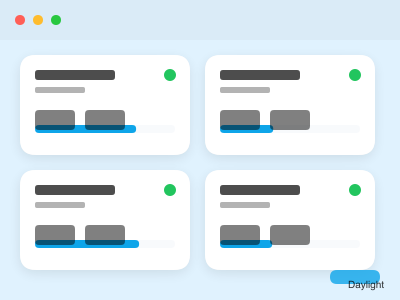<br/>
      <b>Daylight</b><br/>
      <sub>Flat · Light</sub>
    </td>
    <td align="center">
      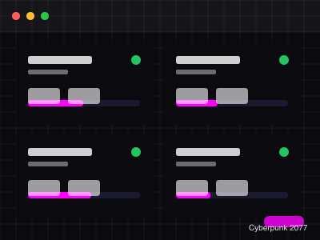<br/>
      <b>Cyberpunk</b><br/>
      <sub>Brutalist · Dark</sub>
    </td>
    <td align="center">
      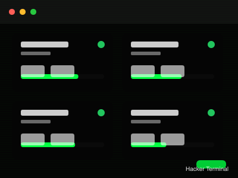<br/>
      <b>Terminal</b><br/>
      <sub>Minimal · Dark</sub>
    </td>
  </tr>
  <tr>
    <td align="center">
      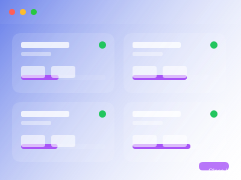<br/>
      <b>Glassmorphism</b><br/>
      <sub>Glass · Dark</sub>
    </td>
    <td align="center">
      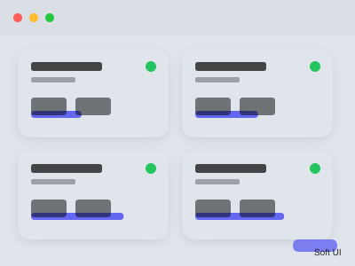<br/>
      <b>Neumorphism</b><br/>
      <sub>Neumorphic · Light</sub>
    </td>
    <td align="center">
      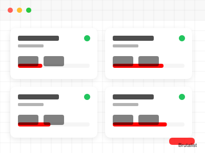<br/>
      <b>Brutalist</b><br/>
      <sub>Brutalist · Light</sub>
    </td>
  </tr>
  <tr>
    <td align="center">
      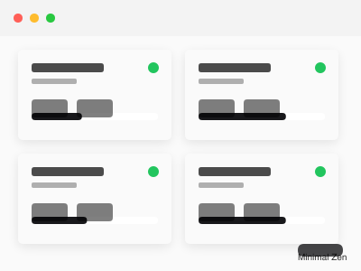<br/>
      <b>Minimal</b><br/>
      <sub>Minimal · Light</sub>
    </td>
    <td align="center">
      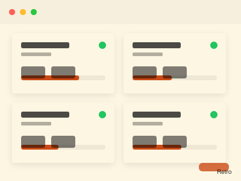<br/>
      <b>Retro</b><br/>
      <sub>Flat · Light</sub>
    </td>
    <td align="center">
      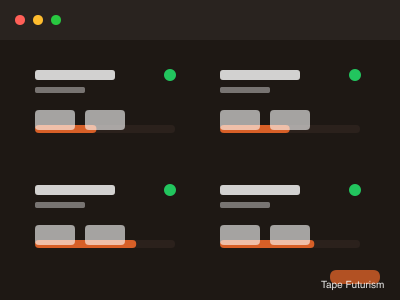<br/>
      <b>Tape</b><br/>
      <sub>Flat · Dark</sub>
    </td>
  </tr>
  <tr>
    <td align="center">
      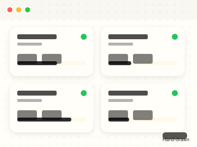<br/>
      <b>Hand-drawn</b><br/>
      <sub>Flat · Light</sub>
    </td>
    <td align="center">
      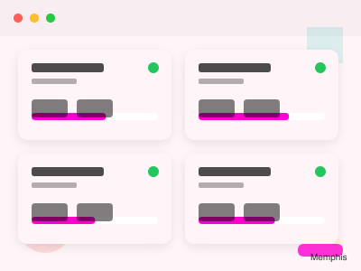<br/>
      <b>Memphis</b><br/>
      <sub>Flat · Light</sub>
    </td>
    <td align="center">
      <br/>
      <b>Skeuomorphic</b><br/>
      <sub>Neumorphic · Light</sub>
    </td>
  </tr>
  <tr>
    <td align="center">
      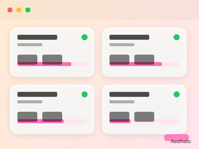<br/>
      <b>Aesthetic</b><br/>
      <sub>Glass · Light</sub>
    </td>
    <td align="center">
      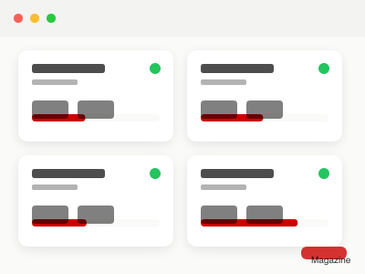<br/>
      <b>Magazine</b><br/>
      <sub>Flat · Light</sub>
    </td>
    <td align="center">
      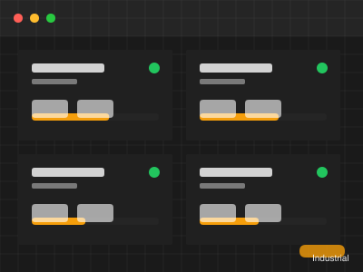<br/>
      <b>Industrial</b><br/>
      <sub>Brutalist · Dark</sub>
    </td>
  </tr>
</table>

### Installation Commands

| Theme | Install |
|-------|---------|
| Daylight | `zsai001/vstats-theme/themes/daylight` |
| Cyberpunk | `zsai001/vstats-theme/themes/cyberpunk` |
| Terminal | `zsai001/vstats-theme/themes/terminal` |
| Glassmorphism | `zsai001/vstats-theme/themes/glassmorphism` |
| Neumorphism | `zsai001/vstats-theme/themes/neumorphism` |
| Brutalist | `zsai001/vstats-theme/themes/brutalist` |
| Minimal | `zsai001/vstats-theme/themes/minimal` |
| Retro | `zsai001/vstats-theme/themes/retro` |
| Tape | `zsai001/vstats-theme/themes/tape` |
| Hand-drawn | `zsai001/vstats-theme/themes/handdrawn` |
| Memphis | `zsai001/vstats-theme/themes/memphis` |
| Skeuomorphic | `zsai001/vstats-theme/themes/skeuomorphic` |
| Aesthetic | `zsai001/vstats-theme/themes/aesthetic` |
| Magazine | `zsai001/vstats-theme/themes/magazine` |
| Industrial | `zsai001/vstats-theme/themes/industrial` |

## Creating Your Theme

### 1. Configure theme.json

Edit `template/theme.json` to define your theme:

```json
{
  "id": "my-awesome-theme",
  "name": "My Awesome Theme",
  "version": "1.0.0",
  "author": "your-username",
  "description": "A beautiful theme for VStats",
  "isDark": true,
  "style": "glass",
  "preview": {
    "primary": "#0a0a0f",
    "secondary": "#1a1a2e",
    "accent": "#ff6b6b",
    "background": "#0a0a0f"
  },
  "fonts": {
    "heading": "\"Inter\", sans-serif",
    "body": "\"Inter\", system-ui, sans-serif",
    "mono": "\"JetBrains Mono\", monospace"
  },
  "borderRadius": "12px",
  "cardStyle": "glass"
}
```

### 2. Write theme.css

All CSS rules must be scoped to `.theme-{your-theme-id}`:

```css
.theme-my-awesome-theme {
  --theme-accent: #ff6b6b;
  --bg-primary: #0a0a0f;
  --text-primary: #f8fafc;
  /* ... */
}

.theme-my-awesome-theme .vps-card {
  background: var(--bg-card);
  /* ... */
}
```

### 3. Add Preview Image (Optional)

Add a `preview.png` screenshot for the theme gallery.

## Installation

Users can install your theme in VStats:

1. Go to **Settings** → **Themes** → **Install Theme**
2. Enter: `your-username/your-repo`
3. Click **Install**

### Installation Formats

| Format | Example |
|--------|---------|
| Repository root | `username/repo` |
| Subdirectory | `username/repo/themes/my-theme` |
| Specific version | `username/repo@v1.0.0` |
| Branch | `username/repo@develop` |

## Documentation

- [Theme Development Guide (English)](docs/THEME-DEVELOPMENT.md)
- [主题开发指南 (中文)](docs/THEME-DEVELOPMENT.zh.md)

## Style Types

| Style | Description |
|-------|-------------|
| `flat` | Solid colors, minimal shadows |
| `glass` | Glassmorphism with blur effects |
| `neumorphic` | Soft shadows, embossed elements |
| `brutalist` | Bold, raw design with hard edges |
| `minimal` | Maximum whitespace, minimal elements |

## License

MIT

